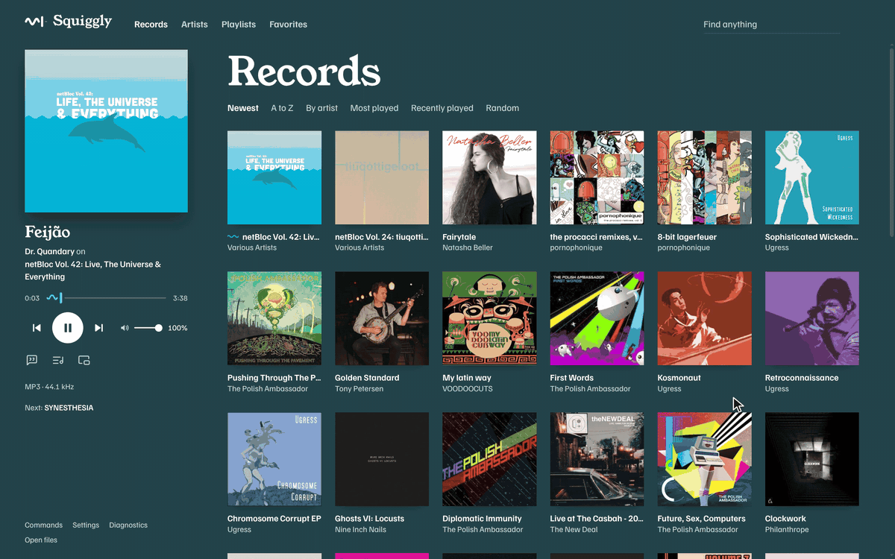
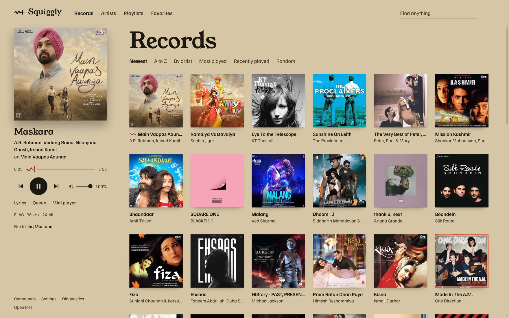
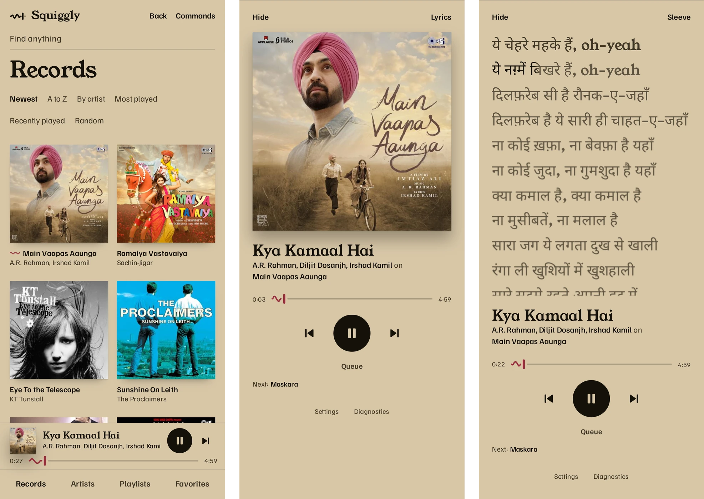

<h1>
  <picture>
    <source media="(prefers-color-scheme: dark)" srcset="docs/brand/wordmark-dark.png">
    
  </picture>
</h1>

Squiggly plays your own music from Navidrome. It asks the server for the original files, plays them through libmpv, and tells you what it knows about the signal path and what it can't know. The window takes its colours from the record that's playing.

It's early software. The website is [squiggly.psthl.com](https://squiggly.psthl.com). It runs on Windows and Fedora, and on Android phones, and a browser version works on phones too.



## What it does

- Browse records, artists, tracks, genres, playlists, and favorites on your server, or play files from your computer. Records filter by decade, artists show a biography and similar artists when the server has them, and records with more than one disc show each disc.
- Open at Home: the saved queue to pick up, records played lately, the newest and most played, your automatic playlists, and what other people on the server are playing. The wordmark and G then H go back to it.
- Rate songs, records, and artists from one to five stars, and list the records and tracks you rate highest.
- Edit the queue and your playlists. The queue follows you between devices through the server.
- Drag records, artists, songs, and playlists onto the queue or a playlist, and drop audio files from your computer onto the desktop app's window to play them.
- Repeat the queue or one song, and shuffle what's left to play (`r` and `s`).
- Start a radio station from any song, record, or artist.
- Star the playing song from the controls or with F. G then C opens its record, and G then . its artist.
- Set a sleep timer from Ctrl+K: it pauses in 15, 30, or 60 minutes, or after this song.
- Build automatic playlists from your library by genre, by decade, and from what's new.
- Show synced lyrics from your files, filling in word by word. Looking up missing lyrics on LRCLIB is off until you turn it on.
- Run as a mini player or from the tray. Media keys and the system media controls work: MPRIS on Linux, the media flyout on Windows. Pressing play with nothing loaded picks up the queue saved on the server.
- Ask Windows for exclusive output. The app reports what mpv accepted and doesn't claim more.
- Find any action with Ctrl+K. Change its keys in `keybindings.json` and add colour themes as files in the config folder (`~/.config/squiggly`, or `%APPDATA%\Squiggly` on Windows); saved changes apply at once.
- Search the library from the bar. All shows a few artists, records, and songs, and See all lists the rest of one kind. Enter goes to the first result, Escape goes back, and the searches you used wait under the empty field.
- Add your own commands, menu items, pages, and themes with extensions: folders of TypeScript in the config folder that reload when you save.






The recording and screenshots use [Navidrome's demo server](https://demo.navidrome.org), whose music its artists released under Creative Commons and other free licences. Lyrics shown come from LRCLIB.

It doesn't do EQ, crossfade, or loudness levelling. It leaves the signal alone, and if you turn the volume below 100% the line under the song says so.

## Install

Download a build from [Releases](https://github.com/parth-thakre/squiggly-music/releases), along with `SHA256SUMS` from the same release, and check it:

```bash
sha256sum --ignore-missing -c SHA256SUMS
```

On Windows, run the setup program or the portable exe. They aren't signed yet, so SmartScreen will warn you. Choose More info, then Run anyway.

On Fedora, `sudo dnf install ./squiggly-music-<version>.x86_64.rpm` installs Squiggly and pulls in `mpv-libs`.

On Android 7 or later, open `Squiggly-Music-<version>-android.apk` on the phone and allow your file manager to install apps when Android asks.

Squiggly checks this repository's releases for a newer version at launch and every six hours. The installed Windows app downloads it in the background and installs it when you restart or quit. The portable exe and the RPM can't replace themselves, so they say a new version is out and link to it. Nothing about you is sent. Settings › Updates turns the check off.

To connect, enter your Navidrome address with any port or subpath (`music.example.com/navidrome` works; without `https://` or `http://`, Squiggly tries HTTPS first, then HTTP), your username, and your password. Squiggly remembers the sign-in and reconnects at launch, keeping the password only as your system encrypts it (Windows' user-account encryption, the macOS Keychain, or the Linux keyring). Without a keyring it keeps the password in memory for the session only. Disconnecting in Settings forgets it.

## Run from source

You need Node 22.16 or newer and libmpv (`mpv-libs` on Fedora).

```bash
npm ci
npm run dev
```

If libmpv isn't on the loader path, set `SQUIGGLY_LIBMPV_PATH` to the library file. Audio runs in a separate Node process that uses the `node` on your PATH, or `SQUIGGLY_NODE_PATH`. Installed builds bring their own Node. The separate process exists because libmpv crashed inside Electron's utility process.

## Browser version

```bash
SQUIGGLY_PREVIEW_NAVIDROME_URL=https://music.example.com \
SQUIGGLY_PREVIEW_NAVIDROME_USER=you \
SQUIGGLY_PREVIEW_NAVIDROME_PASSWORD='your navidrome password' \
SQUIGGLY_WEB_PASSWORD='a long password for this page' \
npm run web
```

This serves the app on 127.0.0.1:5173 and keeps the Navidrome login on the server. Anyone who can open the page acts as that account, so it won't serve other devices unless `SQUIGGLY_WEB_PASSWORD` is set to 12 or more characters. To reach it from your phone over Tailscale, run `tailscale serve --bg 5173`. The browser plays the audio here, not libmpv.

## Android

The Android app connects to your Navidrome server itself and plays with the screen off, with controls in the notification and on the lock screen. It's made for the Galaxy Z Flip (the main screen, Flex Mode, and a view of its own on the Flip 5, 6, and 7 cover screens). Each release includes the APK. To build it yourself, you need a JDK 21 and the Android SDK, which [docs/android.md](docs/android.md) sets up without root:

```bash
npm run android:keystore   # once: the key that signs your release APK
npm run android:build      # dist/android/squiggly-<version>-release.apk and -debug.apk
```

It remembers the sign-in with the password sealed by the Android Keystore, and keeps it for the session only when the Keystore can't be used. Disconnecting in Settings forgets it.

## Tests

```bash
npm run check     # typecheck, build, unit and integration tests
npm run test:ui   # the real interface in Chromium, against a fake Navidrome
```

The libmpv tests only decode audio when `SQUIGGLY_LIBMPV_PATH` points at a library. Otherwise they skip. [docs/development.md](docs/development.md) has the rest.

## More

- [docs/packaging.md](docs/packaging.md) covers installers, pinned runtimes, releases, and checksums.
- [docs/android.md](docs/android.md) covers the Android app: how it's built, signing, and testing on an emulator.
- [docs/audio.md](docs/audio.md) explains what the signal-path readout can and can't tell you.
- [docs/ui-handoff.md](docs/ui-handoff.md) describes how the interface is put together.
- [docs/extensions.md](docs/extensions.md) covers writing extensions and what trusting one means.

## License

Squiggly is [MIT](LICENSE) licensed. The installers include other people's software under their own licenses, listed in [THIRD-PARTY-NOTICES.md](THIRD-PARTY-NOTICES.md).
